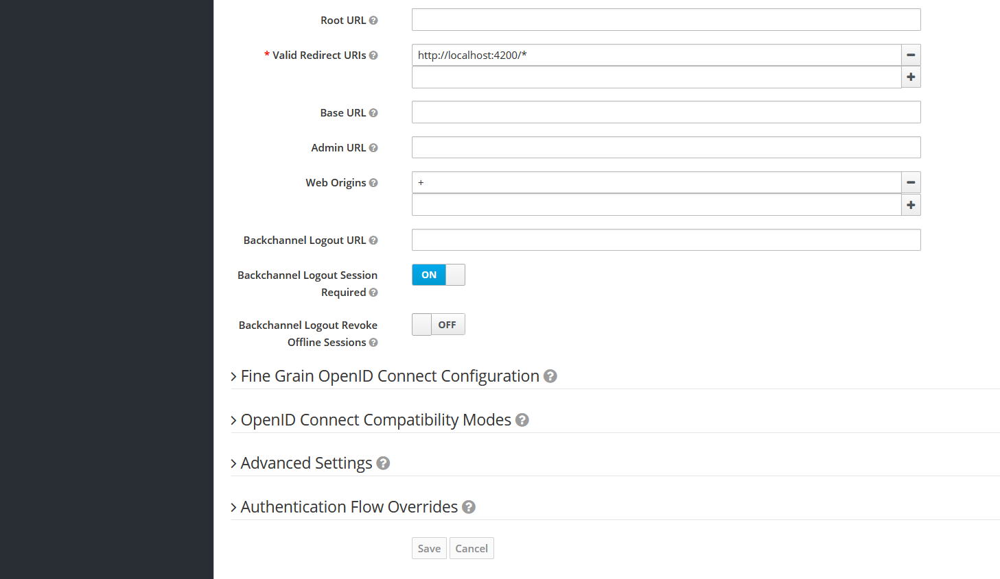

# Starter für das LF10 Projekt

Erstelle einen Fork dieses Projektes auf Github.

## Requirements

* Docker https://docs.docker.com/get-docker/
* Docker compose (bei Windows und Mac schon in Docker enthalten) https://docs.docker.com/compose/install/

### Terminal öffnen

für alles gilt, im Terminal im Ordner docker sein

```bash
cd docker
```

### Abhängigkeiten starten (Postgres, EmployeeBackend)

```bash
docker compose up
```

Achtung: Der Docker-Container läuft dauerhaft! Wenn er nicht mehr benötigt wird, solltest du ihn stoppen.

### Abhängigkeiten stoppen

```bash
docker compose down
```

### Postgres Datenbank wipen, z.B. bei Problemen

```bash
docker compose down
docker volume rm docker_employee_postgres_data
docker compose up
```

## Swagger des Backends

```
http://localhost:8089/swagger
```

# Postgres

```

### Intellij-Ansicht für Postgres Datenbank einrichten (geht nicht in Webstorm!)

```bash
1. Lasse den Docker-Container mit den Abhängigkeiten laufen
2. rechts im Fenster den Reiter Database öffnen
3. In der Database-Symbolleiste auf das Datenbanksymbol mit dem Schlüssel klicken
4. auf das Pluszeichen klicken
5. Datasource from URL auswählen
6. URL der DB einfügen (jdbc:postgresql://postgres-employee:5432/employee_db) und PostgreSQL-Treiber auswählen, mit OK bestätigen
7. Username lf10_starter und Passwort secret eintragen (siehe application.properties), mit Apply bestätigen
8. im Reiter Schemas alle Häkchen entfernen und lediglich vor lf10_starter_db und public Häkchen setzen
9. mit Apply und ok bestätigen 
```

# Keycloak

## Keycloak Token

1. Auf der Projektebene [getBearerToken.http](./getBearerToken.http) öffnen.
2. Neben der Request auf den grünen Pfeil drücken
3. Aus dem Reponse das access_token kopieren

## Keycloak-Integration

Das Login soll als Single Sign On für alle Applikationen der HiTec GmbH implementiert werden. Dabei soll der Benutzer beim Aufruf von http://localhost:4200
zunächst auf eine Seite im Firmendesign mit Informationen über die verschiedenen Anwendungen der HiTec GmbH geleitet werden. Auf dieser Seite 
befindet sich ein Link zum Employee-Management-Service. Klickt der Benutzer auf diesen Link und ist noch nicht angemeldet, wird er zum Login des bereits 
existierenden Keycloak-Service weitergeleitet, loggt sich dort ein und wird zum Frontend des Employee Management Services zurückgeleitet. Nach dem Logout
wird der Benutzer wieder zur Startseite mit den Informationen über die Anwendungen der HiTec GmbH zurückgeleitet. 
Für die Keycloak-Integration benötigst du die Bibliotheken keycloak-angular und keycloak-js. Beide sind im Starter-Projekt schon enthalten (siehe package.json),
brauchen also nicht mehr per npm install hinzugefügt werden. Eine Dokumentation der Bibliotheken findest du hier https://www.npmjs.com/package/keycloak-angular. 
Ein gutes Youtube-Tutorial, das mit der unten angegebenen Konfiguration des Keycloak-Servers funktioniert, ist hier zu finden https://www.youtube.com/watch?v=aykr98e7PlM.

Um den vorhandenen Keycloak-Service in deine Anwendung integrieren zu können, benötigst du folgende Informationen:

URL, über der der Service zu erreichen ist: https://keycloak.szut.dev/auth,
der Realm hat die Bezeichnung: szut,
die ClientId deines Angular Frontends lautet: employee-management-service-frontend

Der Benutzer, mit dem ihr eure Integration testen könnt, hat den Benutzernamen user und das Passwort test. Die einzige Rolle heißt user.

Des Weiteren ist der Client mit der Bezeichnung employee-management-service-frontend wie folgt konfiguriert:




# Bugs

Trage hier die Features ein, die nicht funktionieren. Beschreibe den jeweiligen Fehler. 

